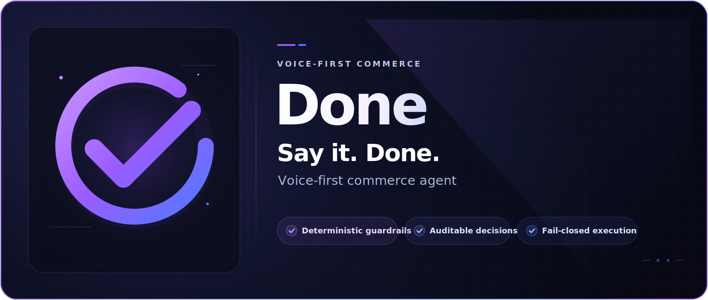

<h1 align="center">Done — voice-first commerce, with control built in</h1>

<p align="center">
  <strong>Delegate the outcome. Keep control of every decision.</strong><br />
  Done turns spoken or typed intent into a versioned mission, validates every hard constraint, and requires plan-bound approval before simulated checkout.
</p>

<p align="center">
  
  
  
  
  
</p>

<p align="center">
  <a href="#capabilities">Capabilities</a> ·
  <a href="#flow">How it works</a> ·
  <a href="#architecture">Architecture</a> ·
  <a href="#quick-start">Quick start</a> ·
  <a href="#api">API</a> ·
  <a href="#operations">Operations</a>
</p>

<p align="center">
  <strong>Recommendations are easy. Reliable execution is the hard part.</strong><br />
  Done is built for what happens next: stock changes, prices move, delivery windows tighten, and payments fail. It replans within policy or stops with a precise request for input.
</p>

<a id="executive-summary"></a>
## Why Done

| **01 / DELEGATE** | **02 / VERIFY** | **03 / AUTHORIZE** | **04 / EXECUTE** |
| :---: | :---: | :---: | :---: |
| Voice or text creates a durable, versioned mission — not a disposable prompt. | Budgets, deadlines, allergens, stock, and delivery are checked against deterministic rules. | Approval is bound to one revision, plan, amount, currency, and merchant. | Done proceeds only while every binding still matches; otherwise it replans or stops for input. |

Done never treats a transcript or model response as purchase consent. It first creates a versioned `MissionContract`, then builds a feasible plan, and only after all guardrails pass does it permit precisely bound approval, reservation, and simulated execution.

> [!IMPORTANT]
> **Current status: technology preview.** The transactional demo catalog, inventory, delivery, payment, and order flows are simulated locally. `live` mode fails closed and will not create a reservation or card without real merchant and issuer adapters. This repository makes no claim of PCI compliance.

<a id="capabilities"></a>
## Capabilities

| Area | Implementation | Safety boundary |
| --- | --- | --- |
| Text intake | Deterministic interpretation of the goal, participants, budget, deadline, and constraints, with evidence | Missing critical data creates a persisted draft and a question instead of inventing a default |
| Voice recording | `expo-audio` → multipart → server-side OpenAI Transcription | The standard `OPENAI_API_KEY` never enters the client bundle |
| Live Voice | OpenAI Realtime over WebRTC with a short-lived secret | The typed command returns through the standard use case and is checked against fresh mission state |
| Mission contract | Versioned goals, constraints, approval policy, and optimistic concurrency | Corrections increment the revision and invalidate stale approval |
| Planning | Catalog planner and OR-Tools CP-SAT for `party_supplies` | All mission requirements covered by a single merchant, within budget, stock, deadline, and independent post-validation |
| Timing | Heuristic price forecast, failure risk, LPTB, and Orange Mode | `WAIT` exists only when the latest point to buy has been calculated; Orange Mode removes risky waiting |
| Approval and funding | Binding to revision, amount, currency, `plan_hash`, and merchant | Guardrails, approval, and the active reservation must reference the same fingerprint |
| Recovery | Product substitution, delivery change, and controlled soft-decline rerouting | Any changed plan requires re-approval; a hard decline stops automation |
| Audit | Durable events, action requests, payment attempts, and portfolio decisions in SQLite | The event timeline explains the business flow; it does not pretend to be a complete access audit log |
| Client | Expo Router, React Native, web, TanStack Query, Zustand, and local notifications | The UI reflects API state and never masks errors with local success states |

### Two catalogs, two distinct purposes

| Dataset | Contents | Use | Important caveat |
| --- | --- | --- | --- |
| Transactional demo catalog | 20 synthetic products across 3 merchants | Planning, basket, delivery, inventory, and checkout demo | The data is a controlled simulator |
| Research catalog | 140 offers from 7 sources, including 29 Minecraft products | `GET /v1/catalog/offers`, filtering, and catalog analysis | Snapshot dated 2026-07-11; prices and most quantities are not live |

Research catalog sources: Allegro, Auchan, Decathlon, delio, Kaufland Marketplace, Lidl, and Smyk. This dataset is currently separate from the catalog used by the workflow to materialize the basket.

### Product experience

**Calm on the surface. Rigorous underneath.**

Done is designed to feel like delegation, not checkout administration. The **Now** screen captures the desired outcome in seconds. **Mission Details** brings the contract, decision rationale, approval state, delivery plan, and recovery history into one auditable view.

<table>
  <tr>
    <td align="center">
      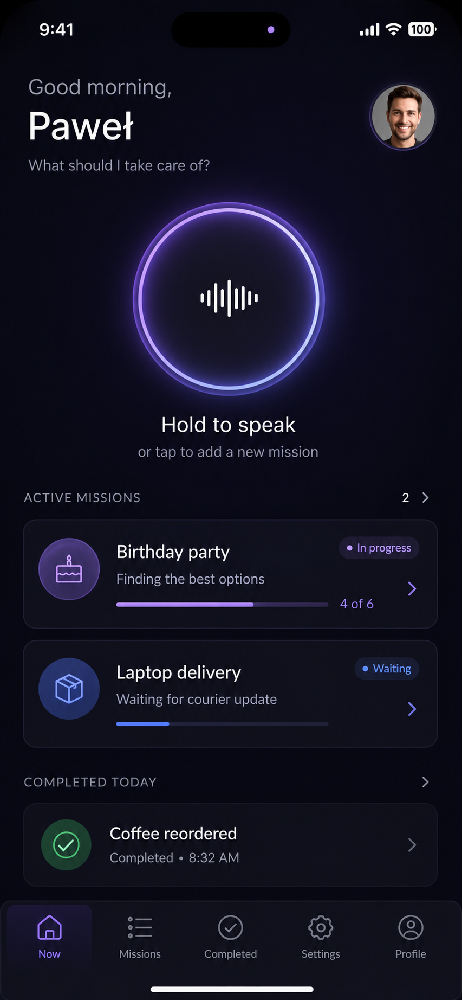<br />
      <sub>Now — delegate an outcome by voice</sub>
    </td>
    <td align="center">
      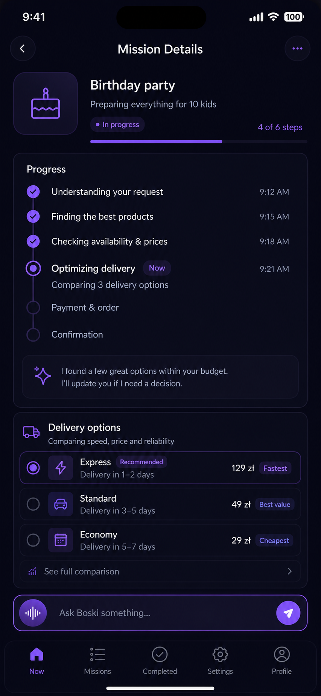<br />
      <sub>Mission Details — review the plan, decisions, approval, and delivery state</sub>
    </td>
  </tr>
</table>

> [!NOTE]
> These images are product-design references from `assets/`. They illustrate the intended experience and are not pixel-perfect screenshots of the current build.

<a id="flow"></a>
## How Done works

Done moves every mission through seven explicit stages. Each stage leaves a durable trace in the API and can stop execution without losing context:

1. **Intake** — text or audio becomes a transcript with evidence.
2. **Clarification** — a missing budget, deadline, scope, or other critical fact creates an `action_request`.
3. **Contract** — complete intent becomes a versioned `MissionContract`.
4. **Plan** — the catalog and portfolio planner search for a complete basket that satisfies hard constraints.
5. **Approval** — the user accepts the exact revision, plan, amount, currency, and merchant.
6. **FundingGate** — guardrails, approval, and reservation must share an identical fingerprint.
7. **Execute or stop** — a compliant plan proceeds to simulated checkout; any uncertainty ends in a controlled stop or a question.

**Nominal path:** `voice/text → contract → plan → guardrails → approval → reservation → FundingGate → checkout`<br />
**Fail-closed path:** `missing facts / noncompliant plan / stale approval → action request → correction or support`

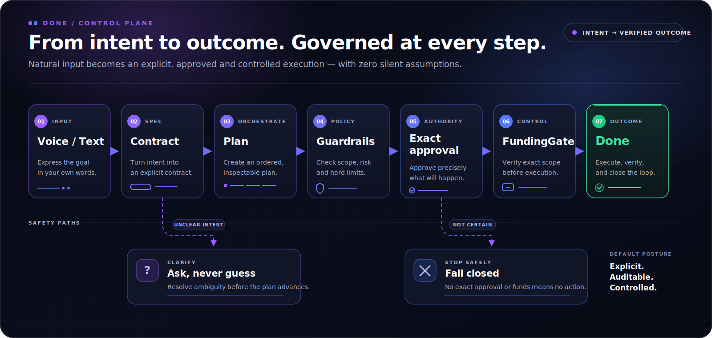

<details>
<summary><strong>Show Mermaid source</strong></summary>

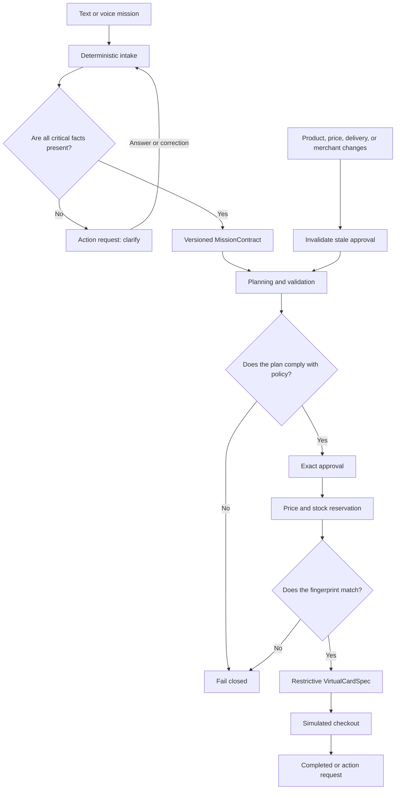

</details>

### Safety invariants

| Situation | System behavior |
| --- | --- |
| Incomplete or ambiguous intent | The mission enters clarification; Done never fills critical fields on the user's behalf |
| No complete, compliant plan | No executable basket, approval, or payment authorization |
| Plan changes after approval | The old approval is superseded; a fresh read-back and acceptance are required |
| Stale revision or `If-Match` | The command is rejected with a conflict instead of overwriting newer state |
| Fingerprint mismatch | `FundingGate` blocks card specification and payment |
| Unresolved `action_request` | The mission remains in `waiting_for_user` or `waiting_for_support` |
| No compliant recovery path | Constraints remain hard; the system escalates or ends the mission |
| Shadow run | Records the decision, comparison, and telemetry; never changes the basket, approval, payment, or status |
| Card data | Only a restrictive `VirtualCardSpec` is stored; never PAN or CVV |

<a id="architecture"></a>
## Architecture

**Dependency flow:** the Expo client communicates with a single FastAPI API. Application services and `MissionWorkflow` invoke domain rules and adapters, SQLite stores state, and OpenAI is an optional voice-only service.

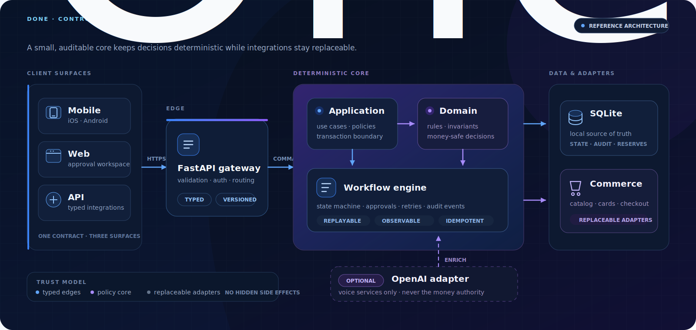

<details>
<summary><strong>Show Mermaid source</strong></summary>

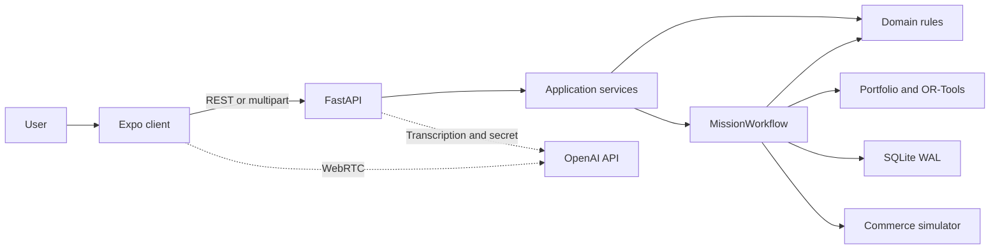

</details>

The backend is a modular monolith with DDD/Clean Architecture boundaries. `main.py` acts as the composition root, while critical domain rules remain independent of FastAPI and OpenAI. At the same time, `MissionWorkflow` intentionally combines some orchestration, SQL, read models, and the local simulator — a clearly identified seam to split before integrating real commerce providers.

| Layer | Responsibility | Core technologies |
| --- | --- | --- |
| Mobile / Web | Voice capture, Live Voice, mission lists and details, approval, settings, and notifications | Expo 57, React Native 0.86, Expo Router, TanStack Query, Zustand |
| Presentation | HTTP, Pydantic, multipart, CORS, request ID, and concurrency headers | FastAPI, Uvicorn |
| Application | Mission, catalog, user, and portfolio use cases; input/output ports | Python 3.13, protocols/DTO |
| Domain | Contracts, statuses, policies, funding, catalog, portfolio, and user | Pure models and deterministic rules |
| Infrastructure | SQLite repositories, OpenAI adapters, forecast, risk, and solver | SQLite WAL, HTTPX, OR-Tools CP-SAT |

For a detailed account of the layers, bounded contexts, and decisions, see [docs/architecture.md](./docs/architecture.md).

### Portfolio decision engine

The planner first freezes a market snapshot, then calculates forecasts, risk, and the latest point to buy. Only then does the solver select a complete action set, after which independent validation decides whether the result may enter the basket.

| Step | Responsibility |
| --- | --- |
| Snapshot | One immutable view of offers, prices, stock, and delivery for the entire run |
| Signals | Price forecast, failure risk, and LPTB for every qualifying offer |
| TimingGate | `normal` mode may consider `wait`; `orange` leaves only `buy_now` |
| CP-SAT | All mission requirements covered by a single merchant within budget, with deterministic optimization |
| Post-validation | Recheck needs, availability, budget, and invariants outside the solver |

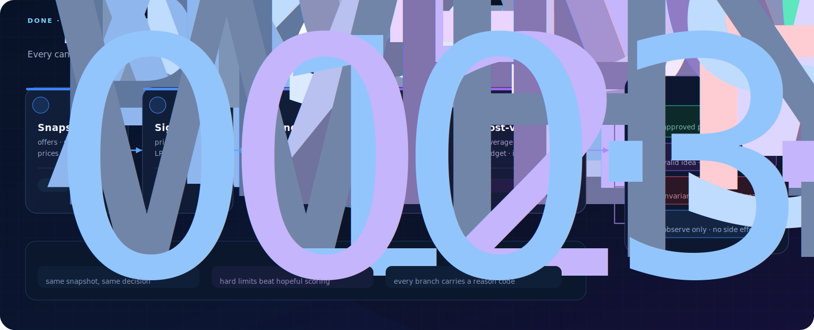

<details>
<summary><strong>Show Mermaid source</strong></summary>

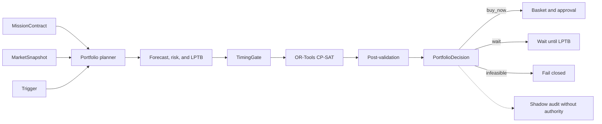

</details>

| Result | Meaning | Effect |
| --- | --- | --- |
| `feasible` | The complete plan satisfies hard constraints and post-validation | Materialize the basket and proceed to approval policy |
| `waiting` | Every selected action may be deferred within its calculated LPTB | No checkout; the decision waits for a trigger or manual replan |
| `infeasible_plan` | No complete plan exists within budget, deadline, and a single merchant | Diagnostics and fail-closed behavior |
| `internal_validation_error` | The solver result failed independent invariants | No projection into the basket |

The portfolio planner currently operates on `party_supplies` missions. Gift missions use a separate deterministic catalog path. Each planner run uses one versioned snapshot, and the solver runs with `num_search_workers=1` and a fixed seed.

### Approval and funding

Approval is not a generic “yes.” It is consent for one specific plan and expires when any element of that plan changes.

| Stage | Transition condition | Failure behavior |
| --- | --- | --- |
| Bind approval | Revision, amount, currency, `plan_hash`, and merchant match the current plan | Reject stale approval and present the new decision |
| Revalidate | The basket still passes every hard guardrail | Create an action request; no reservation |
| Reserve | Price, stock, and delivery remain current | Start recovery or stop the mission |
| FundingGate | Guardrail attestation, approval, and reservation share the same fingerprint | Do not create a card or payment attempt |
| Card specification | Single-use, exact limit, merchant lock, and short TTL | No authority to check out |
| Execute | The simulator returns a payment and order outcome | Controlled recovery or durable waiting for the user |

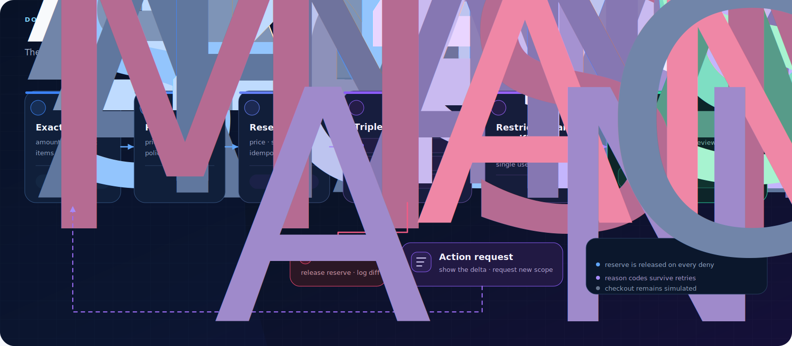

<details>
<summary><strong>Show Mermaid source</strong></summary>

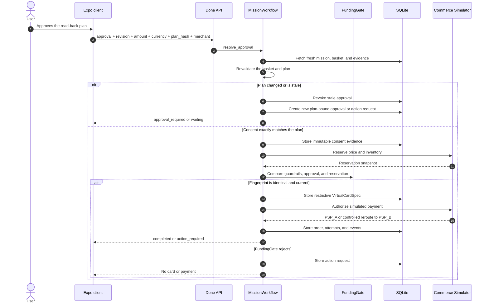

</details>

<a id="quick-start"></a>
## Quick start

### Requirements

| Tool | Version | When it is needed |
| --- | --- | --- |
| Node.js + npm | Node `>=20` | Mobile, web, and root scripts |
| Python | `>=3.13,<3.14` | API |
| `uv` | Current stable release | API environment and dependencies |
| Docker Compose | Optional | Run the API alone in a container |
| `OPENAI_API_KEY` | Optional | Required for real STT and Realtime; text flow works without it |

### macOS, Linux, WSL, or Git Bash

```bash
git clone git@github.com:pawelkonior/done.git
cd done
cp .env.example .env

# Set OPENAI_API_KEY locally only if you need voice
npm run setup
npm run dev
```

### Windows PowerShell

The root `api*` scripts use POSIX environment-variable syntax. In native PowerShell, run the stack in two terminals:

```powershell
# One-time setup from the repository root
Copy-Item .env.example .env
npm.cmd run setup

# Terminal 1: API
Set-Location apps/api
uv run uvicorn app.main:app --env-file ../../.env --reload --host 127.0.0.1 --port 8001
```

```powershell
# Terminal 2: web, from the repository root
npm.cmd run web
```

### Local endpoints

| Service | URL | Notes |
| --- | --- | --- |
| Expo web | [http://localhost:8081](http://localhost:8081) | The port may change if `8081` is occupied |
| Done API | [http://localhost:8001](http://localhost:8001) | Root scripts bind the development API to loopback |
| Decision-loop dashboard | [http://localhost:8090](http://localhost:8090) | Interactive visualization of the active simulation workflow |
| OpenAPI | [http://localhost:8001/docs](http://localhost:8001/docs) | Interactive FastAPI documentation |
| Health | [http://localhost:8001/health](http://localhost:8001/health) | Checks the API and SQLite, not OpenAI |
| Capabilities | [http://localhost:8001/v1/runtime/capabilities](http://localhost:8001/v1/runtime/capabilities) | Read the JSON statuses; HTTP `200` alone does not mean voice is available |

Quick smoke test:

```bash
curl -fsS http://127.0.0.1:8001/health
curl -fsS http://127.0.0.1:8001/v1/runtime/capabilities
```

> [!IMPORTANT]
> `OPENAI_API_KEY` belongs exclusively in the API environment. Never prefix it with `EXPO_PUBLIC_`, because those values are shipped in the client bundle.

### Physical device and WebRTC

Expo Go does not include native `react-native-webrtc`. You need a Done development build, and the phone and computer must be on the same network.

```bash
# One-time development build
cd apps/mobile
npx expo run:ios --device
# or
npx expo run:android --device

# Then, from the repository root
npm run phone
```

`npm run phone` exposes the API on the LAN, starts Metro, and passes both processes a shared random bearer token without printing it to the log. The standard OpenAI key remains on the backend. On native Windows, use WSL/Git Bash or start the two processes equivalently — the `api:phone` script currently uses POSIX syntax.

### Demo walkthrough

The fastest way to understand Done is to watch it handle ambiguity and change without losing the user's authority boundary.

1. Open **Now** and start Live Voice, or hold the orb to record.
2. Say: “I'm organizing a birthday for five children aged ten, in one week, with a budget of 500 PLN.”
3. Done detects the missing shopping scope and delivery time. It persists the mission and asks for clarification instead of guessing.
4. Choose **party supplies**, set the delivery time, then review the versioned contract, portfolio decision, basket, and delivery window.
5. Approve the exact plan, total, currency, and merchant.
6. Enable local fault injection and trigger an out-of-stock event. The compliant substitution changes the plan and invalidates the previous approval, so Done requests re-approval before simulated checkout.
7. Review the final outcome, recovery path, payment attempts, remaining budget, and complete event timeline.

To demonstrate controlled failures, enable them deliberately and only in your local `.env`:

```dotenv
DONE_DEMO_FAILURES_ENABLED=true
DONE_DEMO_ENDPOINTS_ENABLED=true
```

<a id="runtime-modes"></a>
## Runtime modes

| Mode | Commerce | API access | Behavior |
| --- | --- | --- | --- |
| `DONE_COMMERCE_MODE=demo` | Local catalog and simulation | Bearer optional | Complete demo flow with controlled recovery |
| `DONE_COMMERCE_MODE=sandbox` | Local catalog and simulation | Bearer optional | No real transactions; the same controlled execution boundary |
| `DONE_COMMERCE_MODE=live` | No real adapters | Bearer required | Fails closed before reservation, card creation, and payment |
| `DONE_PORTFOLIO_SHADOW_MODE=true` | Additional comparison run | No execution authority | Audit and telemetry without checkout mutation |

> [!CAUTION]
> Configuration profiles do not share one common set of defaults. `.env.example` disables fault injection and demo endpoints, while Docker Compose fallbacks enable them. Always inspect `docker compose config` before exposing a port.

<a id="commands"></a>
## Developer commands

| Goal | Command | Scope |
| --- | --- | --- |
| Install | `npm run setup` | `npm install` + `uv sync --project apps/api --python 3.13 --extra dev` |
| Full development stack | `npm run dev` | API on `127.0.0.1:8001` + Expo web; requires a POSIX shell |
| Web | `npm run web` | Expo web |
| Phone | `npm run phone` | LAN API + Metro + temporary bearer; see the Windows note |
| Typecheck | `npm run typecheck` | TypeScript `strict` |
| Mobile tests | `npm run test:mobile` | Jest / React Native Testing Library |
| API tests | `npm run test:api` | pytest |
| Baseline suite | `npm test` | Typecheck + mobile tests + API tests |
| API lint | `npm run lint:api` | Ruff for `app` and `tests` |
| Web build | `npm run build:web` | Static Expo web export |
| Expo diagnostics | `npm run doctor` | Expo Doctor |
| API in Docker | `docker compose up --build api` | Backend only; SQLite in a volume, host port bound to loopback |

Complete local release gate:

```bash
npm run typecheck
npm run test:mobile
npm run test:api
npm run lint:api
npm run build:web
npm run doctor
```

`npm test` does not run Ruff, the web build, or Expo Doctor. The repository currently has no CI pipeline or coverage data, so this README deliberately avoids a fictional “passing” badge.

<a id="api"></a>
## API

Minimal text mission:

```bash
curl --request POST http://localhost:8001/v1/missions/text \
  --header "Content-Type: application/json" \
  --data '{
    "transcript": "Tomorrow I am organizing a birthday party for ten children. Buy food, drinks and decorations for under 300 PLN, no nuts, delivered before 16:00.",
    "locale": "en-PL",
    "timezone": "Europe/Warsaw"
  }'
```

When authentication is enabled, add `Authorization: Bearer <DONE_API_AUTH_TOKEN>`. Creation returns the same aggregate as the detail endpoint; if facts are missing, the response is a durable `clarification_required` mission with a pending action request.

| Group | Key endpoints |
| --- | --- |
| System | `GET /health`, `GET /v1/runtime/capabilities` |
| Catalog | `GET /v1/catalog/offers` with filtering, sorting, and pagination |
| Missions | `POST /v1/missions/text`, `POST /v1/missions/voice`, list/detail/events, corrections, replan, delivery, and cancel |
| Portfolio | Decision history, manual shadow run, shadow audits, and telemetry |
| Authority | Resolve approval, resolve action request, and request human support |
| User | Profile, settings, export, and merchant list |
| Demo | Fault injection and reset — available only when the relevant flags are enabled |

For the HTTP contract, request/response examples, and concurrency rules, see [docs/api-contract.md](./docs/api-contract.md).

<a id="configuration"></a>
## Configuration

| Group | Variable | Meaning |
| --- | --- | --- |
| Mobile | `EXPO_PUBLIC_API_URL` | Explicit API override; the Android emulator uses `10.0.2.2` by default |
| Mobile | `EXPO_PUBLIC_API_ACCESS_TOKEN` | Shared local deployment token; shipped in the bundle and not a user secret |
| Persistence | `DONE_DB_PATH` | SQLite path |
| CORS | `DONE_CORS_ORIGINS`, `DONE_CORS_ORIGIN_REGEX` | Explicit origins and optional regex; CORS is not authentication |
| Voice | `OPENAI_API_KEY` | Standard key for the API process only |
| Voice | `DONE_STT_ENABLED`, `DONE_REALTIME_ENABLED` | Independent switches for file transcription and Live Voice |
| Commerce | `DONE_COMMERCE_MODE` | `demo`, `sandbox`, or fail-closed `live` |
| Access | `DONE_API_AUTH_ENABLED`, `DONE_API_AUTH_TOKEN` | Deployment-wide bearer; token must be at least 32 characters, and `live` enforces authentication |
| Demo | `DONE_DEMO_FAILURES_ENABLED`, `DONE_DEMO_ENDPOINTS_ENABLED` | Automatic failures and control endpoints for the demo |
| Portfolio | `DONE_PORTFOLIO_SHADOW_MODE`, `DONE_PORTFOLIO_AUTONOMY_ENABLED` | Shadow evaluation and a separate autonomy flag that is off by default |
| Promotion gate | `DONE_PORTFOLIO_SHADOW_MIN_RUNS`, diff/price thresholds | Telemetry conditions for manual promotion review |

See the complete template in [.env.example](./.env.example). Every configuration change requires a process restart.

> [!IMPORTANT]
> `EXPO_PUBLIC_API_ACCESS_TOKEN` is a local shared-deployment barrier, not an identity system. The code does not yet include an IdP, per-user authorization, or tenant isolation.

<a id="repository-map"></a>
## Repository map

```text
.
├── apps/
│   ├── mobile/                 # Expo / React Native / WebRTC / UI
│   └── api/
│       ├── app/
│       │   ├── domain/         # Mission, portfolio, and user rules
│       │   ├── application/    # Use cases and ports
│       │   ├── infrastructure/ # SQLite, OpenAI, forecast, risk, OR-Tools
│       │   └── presentation/   # FastAPI routers and schemas
│       ├── data/               # Research catalog: JSON + TSV
│       ├── sql/                # Standalone research catalog seed
│       └── tests/              # API unit and integration tests
├── assets/
│   ├── readme/                 # Hero and static diagrams visible without Mermaid
│   └── …                       # Design references and execution plan
├── docs/                       # Architecture, API, operations, portfolio plan
├── scripts/dev-phone.mjs       # Authenticated LAN launcher
├── docker-compose.yml          # API-only container + persistent volume
└── package.json                # Root orchestration and quality scripts
```

<a id="operations"></a>
## Operations, observability, and security

### Runtime signals

| Signal | What it confirms | What it does not confirm |
| --- | --- | --- |
| `GET /health` | The process responds, SQLite is readable, and the seed exists | OpenAI availability, write readiness, or real commerce |
| `GET /v1/runtime/capabilities` | STT and Realtime status, including the reason for degraded/unavailable state | HTTP `200` alone does not mean a component is ready |
| `X-Request-ID` | Correlation between a response and its request | Complete distributed tracing |
| Mission events | Audit trail for decisions and the flow of one mission | A technical access audit log |
| Shadow telemetry | Feasibility, timing, and portfolio decision differences | Automatic approval for autonomy |

SQLite runs in WAL mode with foreign keys, `busy_timeout=30s`, one connection per operation, and `BEGIN IMMEDIATE` for writes. The write lock is process-local, so the current deployment assumes a single writer. A live database backup must use the SQLite Online Backup API or a controlled shutdown — never copy only the main file while WAL is active.

### Production-readiness boundaries

| Area | Current state | Required before public production |
| --- | --- | --- |
| Identity | Optional deployment-wide bearer and fixed `demo-user` | IdP, user sessions, authorization, RBAC, and tenant isolation |
| Commerce | Local simulator; `live` stops before reservation and payment authorization | Catalog/inventory/delivery/payment/order adapters, signed webhooks, and reconciliation |
| Persistence | SQLite WAL, one writer, schema bootstrap | Versioned migrations, outbox/durable jobs, scaling strategy, and restore drills |
| Edge security | Explicit CORS and Pydantic validation | TLS, rate limiting, WAF, request-size limits, and a secure reverse proxy |
| Data protection | Payment-method token instead of PAN/CVV | Secrets manager, encryption at rest, retention, rotation, and encrypted backups |
| Observability | Uvicorn logs, request ID, health, and business events | Centralized logs, metrics, tracing, alerts, and technical access auditing |
| Compliance | Restrictive card specification in the demo | Formal threat model, security reviews, and an appropriate compliance scope |

For backup, restore, probes, production-like mode, and incident notes, see [docs/operations.md](./docs/operations.md).

### Troubleshooting

| Symptom | Check first |
| --- | --- |
| Voice returns `503` | `/v1/runtime/capabilities`, `OPENAI_API_KEY`, the STT flag, model, quota, and request ID |
| Realtime is `unavailable` | `DONE_REALTIME_ENABLED`, the key, model access, and whether you are using a development build instead of Expo Go |
| `npm run dev` stops at `DONE_STT_ENABLED` on Windows | API scripts assume a POSIX shell; use WSL/Git Bash or the two-terminal PowerShell recipe |
| API returns `401` | Verify that the client token exactly matches `DONE_API_AUTH_TOKEN` |
| Phone cannot reach the API | Shared LAN, host `0.0.0.0`, firewall, detected Metro address, and `EXPO_PUBLIC_API_URL` |
| `database is locked` | Check for multiple writer processes or a long-running transaction |
| Docker started only the API | This is expected; Compose neither builds nor serves the mobile/web application |

<a id="documentation"></a>
## Documentation

| Document | Contents |
| --- | --- |
| [Architecture](./docs/architecture.md) | Current layers, bounded contexts, persistence, and limitations |
| [API contract](./docs/api-contract.md) | Endpoints, payloads, statuses, and concurrency |
| [Operations](./docs/operations.md) | Runtime, configuration, backup/restore, and security checklist |
| [Portfolio optimization plan](./docs/executive_plan_portfolio_optimization.md) | Decision model, rollout, shadow mode, and telemetry |
| [API README](./apps/api/README.md) | Backend quick start and research catalog |
| [Original execution plan](./assets/execution_plan.md) | Product vision and planning materials; some items are aspirational |

---

<p align="center">
  <strong>Say it. Done.</strong><br />
  <sub>Voice delegates the goal. Code enforces the boundaries.</sub>
</p>
