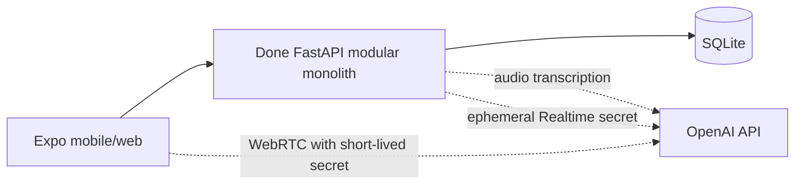

# Architektura backendu Done

## Status dokumentu

Dokument opisuje kod istniejący w repozytorium. Backend jest produkcyjnie
ukierunkowanym modularnym monolitem, ale nadal demonstratorem commerce: katalog,
inventory, dostawa, płatność i zamówienie są lokalnymi symulatorami. Nie ma
integracji z prawdziwym sprzedawcą ani PSP.

## Kontekst systemowy



API jest jedynym publicznym backendem aplikacji. Standardowy klucz OpenAI
pozostaje wyłącznie w procesie API; aplikacja otrzymuje tylko krótkotrwały sekret
Realtime. Tekstowy przepływ misji i wszystkie reguły bezpieczeństwa działają
deterministycznie, bez zewnętrznego modelu.

## Moduły i reguła zależności

Kod jest podzielony na cztery warstwy:

```text
presentation  →  application  →  domain
      ↑                ↑
      └──── infrastructure adapters

main.py = composition root znający wszystkie warstwy
```

### Domain

`app/domain/` zawiera reguły, które nie zależą od FastAPI, SQLite ani klientów
HTTP:

- `common.py`: `Money`, `DomainEvent` i błędy domenowe;
- `mission/model.py`: statusy, macierz przejść, `Mission`, wersjonowany
  `MissionContract`, constraints i failure kinds;
- `mission/policies.py`: `BasketPolicy`, `MissionExecutionPolicy` oraz
  niemutowalne snapshoty koszyka;
- `user/model.py`: `UserProfile`, `UserSettings`, `DeliveryAddress` i
  tokenizowany `PaymentMethod`.

### Application

`app/application/` koordynuje use-case'y:

- `MissionApplicationService` tworzy misję z tekstu albo audio, pobiera
  ustawienia użytkownika i deleguje zapis do `MissionWorkflow`;
- `UserApplicationService` obsługuje profil, ustawienia, statystyki, merchantów
  i eksport;
- `application/ports/mission.py` definiuje inbound `MissionWorkflowPort`, dzięki
  któremu application service nie zależy od konkretnej klasy workflow;
- `application/ports/ai.py` definiuje provider-neutral port
  `SpeechToTextPort` oraz DTO dla audio i transkrypcji;
- `application/ports/realtime.py` definiuje `RealtimeSessionPort`; standardowy
  klucz dostawcy nie jest częścią portu mobilnego ani domeny.

Application layer wyznacza budżet, uczestników, termin, walutę, tytuł i hard
constraints wyłącznie przez deterministyczny interpreter. OpenAI Transcription
dostarcza tylko tekst nagrania, a funkcja Realtime przekazuje transcript do tego
samego use case'u; żaden model nie tworzy ani nie zatwierdza kontraktu misji.

### Presentation

- `app/main.py` jest composition rootem i adapterem HTTP dla misji, approvals,
  health i demo controls;
- `app/presentation/user_router.py` mapuje HTTP na use-case'y profilu i
  ustawień oraz posiada jawne request/response models;
- `app/schemas.py` zawiera walidowane komendy misji.

Presentation odpowiada za Pydantic, multipart, query params, `If-Match`, CORS,
request ID i mapowanie wyjątków na statusy HTTP.

### Infrastructure

- `Database` zarządza połączeniami SQLite, schematem i seedem;
- `SQLiteUserRepository` implementuje port persistence kontekstu użytkownika;
- `OpenAITranscriptionAdapter` wysyła zwalidowane audio do serwerowego endpointu
  OpenAI Audio API z modelem `gpt-4o-transcribe`;
- `OpenAIRealtimeAdapter` tworzy krótko żyjący sekret WebRTC, wiąże go z
  prywatnym hash ID użytkownika i redaguje błędy dostawcy;

## Bounded contexts

### Mission Execution — core domain

Odpowiada za transcript, kontrakt, plan zakupowy, koszyk, delivery selection,
approval, execution, recovery, event timeline i completion summary.

Główne pojęcia:

- `Mission` — aggregate root lifecycle'u, statusu, kroku i revision;
- `MissionContract` — niemutowalna, sekwencyjna wersja celu i ograniczeń;
- `BasketSnapshot` — wejście do czystej walidacji domenowej;
- approval — czasowa zgoda na zakup; pending approval wygasa po dwóch godzinach;
- mission event — trwały, użytkowy log wykonania.

Runtime korzysta z `MissionContract`, `MissionExecutionPolicy` i `BasketPolicy`.
Klasa domenowa `Mission` i jej macierz przejść są przetestowane, ale część
runtime transitions nadal jest wykonywana bezpośrednio przez SQL w
`MissionWorkflow`. Jest to jawne, przejściowe odstępstwo od pełnej reguły Clean
Architecture.

### User / Profile / Settings

Odpowiada za profil bieżącego użytkownika, bezpieczny token płatniczy, adres,
preferencje kontaktu, ustawienia autonomii i statystyki.

Ten kontekst ma pełny przepływ:

```text
user_router → UserApplicationService → UserRepository protocol
                                      → SQLiteUserRepository
```

Ustawienia są snapshotowane do nowej misji jako `MissionExecutionPolicy`:

- `always` zawsze wymaga approval;
- `above_threshold` wymaga approval dla koszyka równego lub większego od progu;
- `autonomous_low_risk` pomija approval wyłącznie dla risk level poniżej 70;
- safe recovery, preferred merchants i default constraints trafiają do
  kontraktu misji.

### OpenAI Transcription

Jest opcjonalnym supporting contextem za `SpeechToTextPort`:

- API wysyła zwalidowany multipart bezpośrednio do OpenAI Audio API z modelem
  `gpt-4o-transcribe`;
- adapter ogranicza rozmiar i format pliku, współbieżność oraz czas żądania, a
  błędy dostawcy redaguje przed zwróceniem ich klientowi.

Wyłączenie STT blokuje wyłącznie prawdziwy multipart audio. Misje tekstowe są
zawsze przetwarzane lokalnie i deterministycznie, a JSON na endpointcie voice
pozostaje dostępny jako ścieżka kompatybilności/accessibility.

### Live Voice Intake

Live Voice jest supporting contextem za `RealtimeSessionPort`. Serwer używa
standardowego klucza wyłącznie do wywołania endpointu OpenAI
`POST /v1/realtime/client_secrets`; Done udostępnia klientowi własny endpoint
`POST /v1/realtime/client-secret`. Klient łączy się z OpenAI przez WebRTC
sekretem krótkotrwałym; klucz standardowy nie jest bundlowany. Sesja używa
`gpt-realtime-2`, głosu `marin`, transkrypcji `gpt-realtime-whisper` i jednej
funkcji `submit_mission`.

Funkcja nie omija domeny. Jej transcript trafia do
`MissionApplicationService`, deterministycznego interpretera,
`MissionExecutionPolicy` i `BasketPolicy`. Model nie może sam zatwierdzić
zakupu, zmienić budżetu ani ogłosić wykonania zewnętrznej akcji.

### Demo Commerce Simulator

Symulator jest obecnie częścią `MissionWorkflow` i seedowanej bazy. Obejmuje:

- 14 syntetycznych produktów i 3 merchantów;
- deterministyczny plan party shopping;
- delivery options;
- symulowane inventory reservation;
- PSP_A i PSP_B;
- lokalne order confirmation;
- fault injection i recovery.

Automatyczne out-of-stock oraz payment soft decline są dodawane tylko, gdy
`DONE_DEMO_FAILURES_ENABLED=true`. Endpointy ręcznego fault injection i resetu
są dostępne tylko, gdy `DONE_DEMO_ENDPOINTS_ENABLED=true`.

To nie jest port do prawdziwego commerce. Catalog, inventory, delivery,
payment i order są nadal bezpośrednimi operacjami SQL/symulatora.

## Agregaty, value objects i policies

### Mission

`MissionStatus` ma zamkniętą macierz przejść oraz stany terminalne `completed`,
`failed` i `cancelled`. `Mission.transition()` sprawdza dozwolone przejście,
zakres kroku, zwiększa revision i emituje `DomainEvent`.

`MissionContract` wymaga:

- niepustego celu;
- co najmniej jednego uczestnika;
- timezone-aware deadline;
- confidence w zakresie 0–1;
- dodatniej, sekwencyjnej wersji.

Korekta HTTP nie tworzy nowej misji: zapisuje kolejną wersję kontraktu dla tego
samego mission ID, zwiększa mission revision i unieważnia poprzedni approval.

### Money

`Money` przechowuje integer minor units. Nie dopuszcza wartości ujemnych ani
operacji między walutami. Publiczne API prezentuje kwoty w major units.

### BasketPolicy

Jest deterministyczną granicą bezpieczeństwa. Sprawdza:

- zgodność waluty;
- budżet;
- delivery deadline;
- wykluczone alergeny;
- zabronione kategorie;
- wymagania materiałowe wyrażone tagami `*-free`.

LLM nie może nadpisać wyniku tej polityki. Ta sama polityka jest wykonywana po
zmianie dostawy i po zamianie produktu.

### UserProfile i UserSettings

`PaymentMethod` przyjmuje wyłącznie token zaczynający się od `pm_`, brand,
last4, expiry i flagę demo. Surowy numer karty nie jest modelem domenowym ani
kontraktem HTTP. `DeliveryAddress` wymaga kompletu podstawowych pól.

## Persystencja i transakcje

SQLite działa w trybie WAL, z foreign keys, `busy_timeout=30s` i połączeniem na
operację. Zapisy są serializowane przez process-local `RLock` i
`BEGIN IMMEDIATE`.

Schemat obejmuje users, profile/settings, missions, versioned contracts,
events, products, merchants, delivery options, baskets/items, approvals,
payment attempts, failure injections i orders. Payment attempts mają unikalny
idempotency key.

`MissionWorkflow` wykonuje cały synchroniczny etap po approval w jednej lokalnej
transakcji. Jest to bezpieczne dla obecnego symulatora, ponieważ nie wykonuje on
prawdziwego zewnętrznego I/O. Tego wzorca nie wolno przenieść bezpośrednio na
realnego merchanta lub PSP.

Nie ma obecnie Alembic, version table, outboxa, workera ani event sourcingu.
`CREATE TABLE IF NOT EXISTS` i addytywne tabele profilu są bootstrapem schematu,
nie pełnym systemem migracji.

## Główne przepływy

### Misja tekstowa

```text
HTTP JSON
→ MissionApplicationService
→ deterministic interpretation
→ user execution-policy snapshot
→ MissionWorkflow + BasketPolicy + SQLite transaction
→ MissionDetail response
```

### Misja głosowa

```text
HTTP multipart
→ upload size check
→ SpeechToTextPort
→ OpenAI Audio API / gpt-4o-transcribe
→ transcript
→ ten sam przepływ co misja tekstowa
```

### Approval i recovery

Approval jest rozwiązywany synchronicznie. W trybie demo workflow może kolejno
obsłużyć niedostępny produkt, bezpieczny zamiennik, soft decline, rerouting PSP
i order confirmation. Każdy krok zapisuje event, a klient może odpytywać eventy
po rosnącym cursorze.

## Decyzje architektoniczne

1. **Safety first:** interpretacja tekstu i polityki bezpieczeństwa są deterministyczne.
2. **Local core:** SQLite i deterministyczny workflow działają bez zewnętrznego SaaS.
3. **Optional voice services:** brak OpenAI nie blokuje tekstowego use case'u.
4. **Server-only speech credentials:** standardowy klucz OpenAI nie trafia do aplikacji.
5. **Single deployable API:** moduły domenowe pozostają w jednym procesie i
   jednej transakcyjnej bazie.
6. **Explicit demo boundary:** fault injection można wyłączyć niezależnie od
   samych endpointów demo.
7. **Optimistic concurrency:** korekta i delivery selection przyjmują mission
   revision przez body lub `If-Match`.

## Ograniczenia aktualnej implementacji

- jeden stały `demo-user`; brak authentication i tenant isolation;
- brak realnych merchantów, inventory, delivery, PSP i order tracking;
- `MissionWorkflow` łączy orchestration, SQL, read models i simulator;
- brak durable background execution, outboxa i reconciliation;
- SQLite i process-local lock zakładają pojedynczą instancję zapisującą;
- brak formalnych migracji schematu;
- brak encryption-at-rest, rate limiting i aplikacyjnego audit logu dostępu;
- runtime metrics są metrykami demonstracyjnymi, nie systemem observability;
- `GET /health` nie sprawdza opcjonalnych usług OpenAI;
- profile i settings są trwałe, ale nie są powiązane z uwierzytelnioną sesją.

Realne commerce integrations muszą zostać dodane jako porty application layer,
z osobnymi adapterami infrastructure. Nie są obecnie zaimplementowane.
