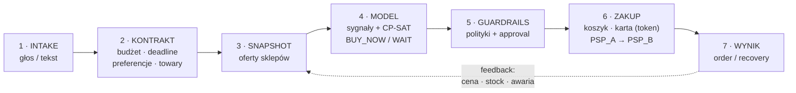

# Executive Plan: Live Loop Graph — dashboard demonstracyjny Done

## Decyzja wykonawcza

Dashboard pokazuje **jedną rzecz**: gdzie w pętli decyzyjnej znajduje się
aplikacja w tej chwili i jakie akcje właśnie wykonuje. Forma: **graf pętli**
z podświetlonym aktywnym węzłem plus wąski ticker ostatnich akcji. Nic więcej.

Świadomie rezygnujemy z wcześniejszej koncepcji sześciu paneli (kontrakt,
oferty, tabela solvera, checklisty). Publiczność na hackathonie ma w dwie
sekundy zrozumieć „system jest TERAZ tutaj i robi TO" — nie czytać dane.

Dashboard pozostaje **czystą projekcją**: nie zawiera logiki biznesowej i nie
wykonuje żadnych akcji. Cały stan odtwarza z istniejącego, zmergowanego już do
mastera event streamu (`GET /v1/missions/{id}/events`). **Nie wymaga żadnych
zmian w API** poza dopisaniem originu do `DONE_CORS_ORIGINS`.

## Graf pętli decyzyjnej

Siedem węzłów odpowiadających realnym etapom systemu i jedna krawędź zwrotna:



Stan węzła: **uśpiony** (szary), **aktywny** (pulsujący, dokładnie jeden),
**zaliczony** (akcent), **błąd/recovery** (ostrzegawczy). Krawędź zwrotna
zapala się przy replanie — to jest moment „wow" prezentacji.

## Mapowanie event → węzeł

Jedyna logika dashboardu to słownik: typ eventu → węzeł grafu. Nazwy z
`workflow.py` na masterze:

| Węzeł | Eventy |
| --- | --- |
| 1 Intake | `mission.created`, `voice.transcribed`, `intent.parsed` |
| 2 Kontrakt | `contract.created`, `contract.revised`, `mission.corrected` |
| 3 Snapshot | `market.snapshot_captured`, `catalog.searched` |
| 4 Model | `basket.optimized`, `plan.created`, `portfolio.replanned`, `portfolio.waiting`, `portfolio.infeasible`, `timing.orange_mode` |
| 5 Guardrails | `policy.validated`, `approval.requested`, `approval.resolved`, `approval.skipped`, `approval.superseded` |
| 6 Zakup | `execution.started`, `inventory.reserved`, `payment.attempted`, `payment.declined`, `payment.rerouted`, `payment.authorized`, `delivery.selected` |
| 7 Wynik | `order.confirmed`, `mission.completed`, `mission.failed`, `mission.cancelled` |
| krawędź zwrotna | `price.changed`, `inventory.unavailable`, `product.replaced`, `recovery.started`, `delivery.switched` |

Ostatni event wyznacza węzeł aktywny; wszystkie wcześniejsze węzły na ścieżce
są zaliczone. Event nieznanego typu nie psuje grafu — trafia tylko do tickera.

## Ekran

```text
┌──────────────────────────────────────────────────────┐
│ DONE · misja: „Urodziny Zosi”         ● LIVE  12:32  │
├──────────────────────────────────────────────────────┤
│                                                      │
│              [ GRAF PĘTLI — cała szerokość ]         │
│                                                      │
├──────────────────────────────────────────────────────┤
│ ticker: 12:32:09 payment.declined PSP_A → rerouting  │
└──────────────────────────────────────────────────────┘
```

- nagłówek: nazwa misji + wskaźnik LIVE — bez selektorów i metadanych;
- graf: ręcznie rozmieszczone SVG (7 węzłów), bez biblioteki grafowej;
- ticker: 3–5 ostatnich eventów, jedna linia każdy, ludzki opis z pola
  `title` eventu;
- ciemny motyw i akcenty aplikacji mobilnej; typografia czytelna z końca sali.

## Architektura

- `apps/dashboard`: Vite + vanilla TypeScript (bez Reacta — jeden ekran,
  jeden słownik, jedna pętla pollingu; mniej zależności na hackathon);
- polling `GET /v1/missions?sort=updated` co 2 s wybiera najświeższą aktywną
  misję (auto-follow — prezenter nic nie klika), potem
  `GET /v1/missions/{id}/events?after_id=<cursor>` co 1 s;
- zero zapisu, zero nowych endpointów; jedyna zmiana w repo poza
  `apps/dashboard`: port dashboardu w domyślnym `DONE_CORS_ORIGINS` i skrypt
  `npm run dashboard` (+ wpięcie do `npm run dev`).

## Etapy

### Etap 1 — graf na żywo

Scaffold, statyczny SVG grafu, polling eventów, mapowanie event → węzeł,
podświetlenie aktywnego węzła i ścieżki, ticker.

**Exit criteria:** misja utworzona głosem w aplikacji mobilnej „wędruje" po
grafie od Intake do Wyniku bez odświeżania strony, z opóźnieniem ≤ 2 s.

### Etap 2 — pętla zwrotna i szlif sceniczny

Animacja krawędzi zwrotnej przy `price.changed` / recovery, stan
infeasible/failed, tryb pełnoekranowy, obsługa `POST /v1/demo/reset` z
klawiatury (za istniejącą flagą demo), test odtworzenia zakończonej misji
(graf działa też z historii — plan awaryjny, gdy live demo zawiedzie).

**Exit criteria:** scenariusz „zmiana ceny → replan → ponowny approval →
zakup" trzykrotnie z rzędu czytelnie animuje pełną pętlę.

## Poza zakresem

- panele danych (oferty, tabele solvera, checklisty) — celowo usunięte;
- nowe endpointy i jakiekolwiek zmiany w silniku;
- WebSockety/SSE, autentykacja, hosting — polling i localhost wystarczą.
