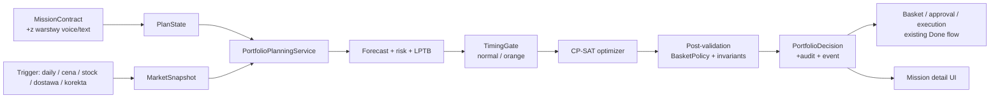

# Executive Plan: silnik decyzji portfolio dla Done

## Decyzja wykonawcza

Rozbudowujemy **istniejącą misję zakupową Done**, a nie tworzymy drugiego
workflow. Głos i tekst nadal tworzą `MissionContract`; następnie nowy,
deterministyczny silnik portfolio przekształca kontrakt, stan planu i spójny
snapshot rynku w audytowalną decyzję zakupową.

LLM pozostaje wyłącznie w warstwie intake/interpretacji. Nie prognozuje cen,
nie uruchamia solvera i nie omija polityk bezpieczeństwa. Decyzja kupić teraz
albo czekać będzie wynikiem reguł czasu, modeli ryzyka oraz OR-Tools CP-SAT.

Pierwsze wydanie działa w granicach obecnego produktu: jeden merchant na
zamówienie. Silnik może analizować oferty wielu merchantów, ale ma twarde
ograniczenie `single_merchant_checkout`. To pozwala zastąpić obecny stały
`PLAN_ITEMS` bez łamania modeli `baskets`, delivery i approval. Wielokoszykowe
zamówienie jest zaplanowane jako osobne rozszerzenie, nie jako ukryty kompromis
w pierwszej wersji.

## Cel biznesowy

Użytkownik formułuje misję raz. Aplikacja:

1. utrzymuje jej niezmienny kontrakt oraz aktualny `PlanState`;
2. reaguje na trigger (utworzenie/korekta misji, harmonogram, zmiana ceny,
   zapasu lub dostawy);
3. wybiera wykonalny plan zakupowy z uwzględnieniem budżetu, terminu, jakości,
   dostępności i ceny;
4. wymaga akceptacji tylko wtedy, gdy nakazuje to polityka użytkownika;
5. zapisuje powody decyzji oraz pozwala użytkownikowi zrozumieć, dlaczego
   system kupuje teraz lub bezpiecznie czeka.

## Dopasowanie do obecnej aplikacji

| Co już jest | Rola po integracji |
| --- | --- |
| `MissionApplicationService` | Pozostaje granicą dla voice/text i buduje deterministyczny `MissionContract`. |
| `MissionWorkflow` | Przestaje sam wybierać stałe `PLAN_ITEMS`; wywołuje use case planowania i projektuje zatwierdzoną decyzję do istniejącego koszyka/approval. |
| `MissionContract` i `MissionExecutionPolicy` | Są źródłem hard constraints, preferencji i polityki approval. |
| `BasketPolicy` | Pozostaje niezależnym, końcowym walidatorem bezpieczeństwa po solverze. |
| SQLite: `products`, `merchants`, `delivery_options` | Stanowią katalog demonstracyjny; zostają rozszerzone o wersjonowane snapshoty ofert, ceny i dostępność. |
| `mission_events`, revision oraz pending approvals | Są audytem, ochroną przed równoległymi zmianami i mechanizmem unieważniania akceptacji po replanie. |
| Ekran szczegółów misji | Zyskuje kartę decyzji portfolio i sygnał timingowy; zachowuje kontrakt, koszyk, dostawę i approval. |



## Architektura docelowa

### Granice odpowiedzialności

`presentation` przekazuje komendy i zwraca read model. Nie wykonuje obliczeń.
`application` orkiestruje jeden run planowania i jest właścicielem portów.
`domain` przechowuje modele, enumy, hard rules oraz postwalidację.
`infrastructure` dostarcza SQLite, heurystyki/model forecastu, kalkulację ryzyka
i adapter OR-Tools.

Proponowany układ w `apps/api/app/`:

```text
domain/
  portfolio/
    model.py              # PlanState, CandidateOffer, CandidateAction, PortfolioDecision
    enums.py              # action/status/signal/result codes
    policies.py           # TimingGate, hard constraints, post-validation
application/
  portfolio_planning_service.py
  ports/
    portfolio.py          # forecast, risk, catalog, state, decision, optimizer
infrastructure/
  persistence/
    portfolio_repository.py
    market_snapshot_repository.py
    price_history_repository.py
  forecasting/
    heuristic_price_forecaster.py
    conformal_calibrator.py
  risk/
    heuristic_failure_risk.py
  optimization/
    ortools_cp_sat_optimizer.py
```

`MissionWorkflow` nie powinien importować OR-Tools, forecastu ani modeli
ryzyka. Otrzyma wyłącznie port/use case `PortfolioPlanningService` i wynik
`PortfolioDecision`.

### Kontrakty domenowe

Minimalne typy wejścia i wyjścia:

```text
PlanState
  mission_id, contract_version, needs, budget_minor, currency, deadline,
  approval_policy, hard_constraints, soft_preferences

MarketSnapshot
  id, captured_at, freshness_deadline, catalog_version, offers[]

CandidateOffer
  offer_id, need_id, merchant_id, product_id, price_minor, stock,
  delivery_distribution, eligibility, quality attributes

CandidateAction
  offer_id, action = BUY_NOW | WAIT, timing_mode, price_signal,
  risk_signal, lptb, objective_terms

PortfolioDecision
  id, mission_id, snapshot_id, trigger, status,
  selected_actions, totals, constraint_report, explanations,
  solver_metadata, created_at
```

Wszystkie kwoty w silniku oraz persystencji pozostają integerami w groszach
(`*_minor`/`*_cents`). Publiczne API może, jak dziś, prezentować major units.

### Reguły niepodlegające negocjacji

- `WAIT` powstaje wyłącznie razem z policzonym `LPTB` dla pary `need_id + offer_id`.
- Gdy `today >= LPTB` lub ryzyko niedostępności przekracza próg, `TimingGate`
  usuwa `WAIT` tylko dla zagrożonej oferty/potrzeby (Orange Mode).
- Budżet, MUST, dostępność, termin dostawy, alergeny i LPTB są hard constraints.
- Forecast jedynie dostarcza sygnał; nie decyduje o portfelu.
- Solver wybiera plan, ale jego wynik zawsze przechodzi ponowną walidację.
- Brak rozwiązania zwraca `INFEASIBLE_PLAN` z diagnostyką, nigdy niepełny koszyk.
- Jeden run używa dokładnie jednego wersjonowanego `MarketSnapshot`.
- Ten sam `PlanState` i snapshot muszą dawać ten sam wynik konfiguracji bazowej.

## Dane i trwałość

Aktualna baza ma bieżącą cenę i stan produktu, ale nie ma historii ani
wersjonowanego snapshotu. Przed uruchomieniem planowania cyklicznego należy
dodać wersjonowane migracje schematu (obecne `CREATE TABLE IF NOT EXISTS` nie
jest wystarczające dla danych decyzyjnych).

Nowe tabele pierwszego wydania:

| Tabela | Cel |
| --- | --- |
| `market_snapshots` | Id, czas pobrania, źródło, hash, status świeżości i wersja katalogu. |
| `offer_snapshots` | Niezmienny obraz oferty: cena, stock, ETA, niezawodność i atrybuty użyte w runie. |
| `price_observations` | Szereg czasowy ceny dla `offer_id`; wejście do forecastu i kalibracji. |
| `inventory_observations` | Stan zapasu i sygnały wysyłki dla ryzyka oczekiwania. |
| `plan_states` | Zmaterializowany stan potrzeb misji, deadline i wersja kontraktu. |
| `portfolio_decisions` | Nagłówek wyniku, trigger, snapshot, status solvera i objaśnienia. |
| `portfolio_actions` | Każda rozważona/wybrana akcja wraz z sygnałami i LPTB. |
| `optimizer_runs` | Czas, wersja modelu, seed, parametry i diagnostyka wykonalności. |

`portfolio_decisions` będzie źródłem audytowym. Istniejący `baskets` jest
projekcją wybranych `BUY_NOW` po postwalidacji. Dzięki temu przyszła zmiana
modelu solvera nie nadpisuje historii decyzji ani zatwierdzeń.

## Plan wdrożenia

### Etap 0 — kontrakt produktu i decyzje graniczne

**Rezultat:** niezmienne zasady, które ograniczają implementację.

- Zatwierdzić semantykę `needs` w `MissionContract`: co jest wymagane,
  opcjonalne, zastępowalne i w jakiej ilości.
- Potwierdzić etapowy limit `single_merchant_checkout`; zapisać go jako jawną
  hard constraint konfiguracyjną, a nie ukryte założenie SQL.
- Zdefiniować taxonomy triggerów: `mission_created`, `contract_revised`,
  `daily`, `price_changed`, `stock_changed`, `delivery_changed`.
- Ustalić domyślne progi Orange Mode, safety buffer i maksymalną świeżość
  snapshotu jako konfigurację wersjonowaną, nie magiczne liczby w solverze.
- Ustalić, kiedy replan unieważnia approval: zawsze, gdy zmienia się cena,
  merchant, delivery, selected action lub istotny poziom ryzyka.

**Exit criteria:** ADR-y i JSON/Pydantic contracts są zaakceptowane; żadna
reguła biznesowa nie jest dointerpretowywana przez UI ani LLM.

### Etap 1 — fundament domenowy i migracje

**Rezultat:** aplikacja potrafi zapisać całe wejście i wyjście runu, bez
zmiany jeszcze widocznego planu zakupów.

- Dodać moduł `domain/portfolio` i immutable dataclasses/Pydantic DTO dla
  kontraktów powyżej.
- Wprowadzić `schema_migrations` oraz wersjonowane migracje SQLite przed
  dodaniem tabel snapshotów i decyzji.
- Zbudować repozytoria do zapisu/odczytu snapshotu, historii ceny, `PlanState`
  i decyzji.
- Rozszerzyć dane demo o wiele ofert odpowiadających tej samej potrzebie, z
  różnymi cenami, zapasami, ETA i merchantami.
- Utworzyć `MarketSnapshotBuilder`, który najpierw czyta obecne dane demo;
  przyszłe integracje katalogowe będą adapterami tego samego portu.

**Exit criteria:** run może zostać zrekonstruowany wyłącznie z identyfikatora
decyzji; nie ma odczytu „aktualnej” ceny podczas postwalidacji starej decyzji.

### Etap 2 — deterministyczny MVP forecastu, ryzyka i LPTB

**Rezultat:** każda oferta otrzymuje wyjaśnialne sygnały, bez zależności od
trenowanego modelu.

- Zdefiniować porty `PriceForecastService`, `FailureRiskService`,
  `LPTBService` oraz `PortfolioOptimizer` w application layer.
- Wdrożyć bazowe adaptery: forecast oparty na historii/zmianie ceny,
  kalibracja z konserwatywnym przedziałem oraz ryzyko z zapasu, ETA i
  niezawodności merchanta.
- Zaakceptować brak historii jako stan jawny: conservative `BUY_NOW_PREFERRED`
  albo neutralny sygnał według konfigurowanej polityki — nigdy fałszywa
  pewność predykcji.
- Obliczać `LPTB = deadline - p95_delivery - safety_buffer` dla każdej oferty
  i zapisać wejścia kalkulacji w `portfolio_actions`.
- Zaimplementować `TimingGate` i testy Normal/Orange Mode.

**Exit criteria:** nie istnieje akcja `WAIT` bez LPTB; w Orange Mode nie da się
zbudować takiej akcji dla zagrożonej oferty.

### Etap 3 — globalna optymalizacja CP-SAT

**Rezultat:** stały `PLAN_ITEMS` zostaje zastąpiony przez solver.

- Dodać `ortools` jako zależność API i adapter `OrToolsCpSatOptimizer`.
- Modelować zmienne binarne dla `BUY_NOW` / `WAIT`, wyboru oferty, kategorii
  oraz merchanta; w MVP dodać `single_merchant_checkout`.
- Dodać hard constraints: pokrycie każdej MUST need, budżet, stock, eligibility,
  termin, LPTB i merchant scope.
- Dodać skalowalny cel soft: jakość, cena, ryzyko, wygoda, preferowany merchant
  i koszt czekania. Wszystkie współczynniki są konfiguracją wersjonowaną.
- Dodać diagnostykę infeasibility — najpierw raport niespełnionych hard
  constraintów; relaksowane mogą być wyłącznie soft constraints.
- Wykonać niezależną postwalidację wyniku przez policy/domain service i
  istniejący `BasketPolicy` przed utworzeniem koszyka.

**Exit criteria:** plan wybiera wyłącznie wykonalne akcje; `INFEASIBLE_PLAN`
zawiera zrozumiały powód i nie tworzy approval ani koszyka.

### Etap 4 — orkiestracja misji i triggery

**Rezultat:** nowy silnik jest rzeczywistą częścią lifecycle'u Done.

- Wydzielić z `MissionWorkflow.create_mission()` logikę stałego koszyka i
  zastąpić ją wywołaniem `PortfolioPlanningService.run()`.
- Kolejność lifecycle'u: contract → snapshot → planning → signals → optimize →
  validate → decision persisted → basket projection → approval/execution.
- Emitować zdarzenia domenowe/UI: `market.snapshot_captured`,
  `timing.orange_mode`, `portfolio.optimized`, `portfolio.infeasible`,
  `portfolio.replanned`, `approval.superseded`.
- Dodać idempotency key: `mission_id + contract_version + snapshot_id + trigger`.
- Reużyć istniejący mechanizm revision i wymiany pending approval po każdym
  istotnym replanie.
- Dla `daily` i event-driven triggerów wprowadzić durable dispatcher/outbox
  oraz worker. Nie uruchamiać codziennego planowania wyłącznie jako kodu w
  request/response FastAPI.

**Exit criteria:** ręczny trigger i korekta misji tworzą nową, audytowalną
decyzję; retry nie tworzy drugiego zakupu ani drugiego approval.

### Etap 5 — API i interfejs użytkownika

**Rezultat:** użytkownik widzi decyzję, ryzyko i uzasadnienie bez ekspozycji
surowej złożoności solvera.

- Rozszerzyć `GET /v1/missions/{id}` o sekcję `portfolio_decision`; zachować
  obecne pola `basket`, `approval`, events i mobile compatibility.
- Dodać `POST /v1/missions/{id}/replan` dla jawnego odświeżenia oraz
  `GET /v1/missions/{id}/portfolio-decisions` dla historii/audytu.
- Zmienić `POST /v1/missions/text` i `/voice` tak, aby wynik planowania był
  częścią standardowego tworzenia misji, nie drugą ścieżką produktu.
- Dodać w mobile `DecisionCard`: rekomendacja, cena teraz vs oczekiwana,
  pewność/ryzyko, deadline i ludzkie wyjaśnienie.
- Dodać statusy/events dla replanowania i Orange Mode, ale nie mnożyć kroków
  timeline — obecny etap `optimizing` może zawierać „watching price / buy now”.
- Approval ma prezentować różnicę względem poprzednio zatwierdzonego planu,
  jeśli replan go zastąpił.

**Exit criteria:** użytkownik może rozróżnić „kup teraz, bo termin jest
zagrożony” od „czekaj, bo jest bezpiecznie i cena jest niekorzystna”, a
odpowiedź API jest kompatybilna wstecz z dzisiejszym klientem.

### Etap 6 — jakość, obserwowalność i rozszerzenia

**Rezultat:** kontrolowany rozwój od demonstratora do usługi operacyjnej.

- Pokryć testami modele domenowe, gate, optimizer, repozytoria, migracje,
  endpointy, approval invalidation i komponenty mobile.
- Mierzyć czas solvera, odsetek planów wykonalnych, liczność Orange Mode,
  replan rate, relaksacje soft constraints oraz różnicę przewidywanej i
  obserwowanej ceny.
- Wprowadzić feature flag dla nowego silnika i shadow mode: liczyć decyzję obok
  starego koszyka, logować różnicę, lecz jeszcze nie wykonywać nowej decyzji.
- Dopiero po danych z shadow mode wymienić heurystyki na trenowany forecast,
  conformal calibration i survival-style failure model.
- Następnie rozszerzyć `single_merchant_checkout` do `PurchasePlan` z wieloma
  fulfillment groups, dostawami, approval i płatnościami per merchant.

## Plan testów i kryteria akceptacji

### Testy funkcjonalne

1. Ten sam `PlanState` i `MarketSnapshot` daje ten sam `PortfolioDecision`.
2. Wszystkie wybrane `BUY_NOW` spełniają budget, stock, deadline, alergeny i
   wymagania kategorii.
3. Każdy `WAIT` ma `LPTB`; Orange Mode usuwa tylko zagrożone `WAIT`.
4. Brak wykonalnego planu zwraca `INFEASIBLE_PLAN` z listą konfliktów i nie
   materializuje koszyka/approval.
5. Korekta misji, zmiana delivery lub ceny istotnej dla decyzji unieważnia
   poprzedni approval i podnosi revision.
6. Ponowienie triggera z tym samym kluczem jest idempotentne.
7. Postwalidacja odrzuca celowo uszkodzony wynik adaptera solvera.

### Testy jakości danych i operacyjne

- Snapshot wygasły lub niekompletny daje `VALIDATION_ERROR`, nie decyzję.
- Brak historii ceny jest widoczny jako niska pewność/konserwatywny fallback.
- Raport runu zawiera wersję modelu, konfigurację, czas solvera i źródła danych.
- Próby użytkownika na starym `revision` nadal dostają `409`, jak dziś.

## Ryzyka i sposób ograniczenia

| Ryzyko | Ograniczenie |
| --- | --- |
| Obecny katalog ma tylko cenę bieżącą, bez historii | Start od heurystyk i jawnego niskiego confidence; rozpocząć zbieranie obserwacji przed trenowaniem modelu. |
| `MissionWorkflow` łączy SQL, workflow i symulator | Wydzielić nowy use case za portem; refaktoryzować tylko ścieżkę planowania, nie całą aplikację naraz. |
| Jeden koszyk/merchant nie wyraża pełnego portfolio | Jawnym ograniczeniem MVP jest pojedynczy merchant; model decyzji zachowuje merchant per offer, aby nie blokować drugiego etapu. |
| Synchroniczny backend nie obsłuży niezawodnie daily triggerów | Wprowadzić outbox/worker przed aktywacją harmonogramów produkcyjnych. |
| Solver może narastać wraz z liczbą ofert | Limitować liczbę kandydatów na need, ustawić timeout i raportować rozwiązanie/diagnostykę. |
| Approval staje się nieaktualny po replanie | Powiązać approval z `decision_id` i przy zmianie unieważniać go atomowo z revision. |

## Kolejność pierwszego sprintu implementacyjnego

1. Wersjonowane migracje + tabele snapshot/decision.
2. Domain DTO, porty i repozytoria.
3. Generator danych demonstracyjnych oraz `MarketSnapshotBuilder`.
4. Heurystyczne forecast/risk/LPTB + TimingGate i testy.
5. CP-SAT dla jednego merchanta + postwalidacja.
6. Integracja z `MissionWorkflow`, events i approval invalidation.
7. Rozszerzenie read model/API, a następnie `DecisionCard` w mobile.
8. Shadow mode, telemetry i przełączenie feature flag po pozytywnej walidacji.

## Co nie wchodzi do pierwszego wdrożenia

- LLM w pętli decyzyjnej;
- trenowany model cen lub survival model bez zebranych danych;
- realne integracje merchantów, PSP i automatyczne zakupy;
- wielomerchantowe checkouty;
- pełny event sourcing.

Takie ograniczenie utrzymuje pierwsze wydanie małe, testowalne i kompatybilne
z aktualnym flow: mission → contract → optimize → validate → approval →
execution → recovery.
